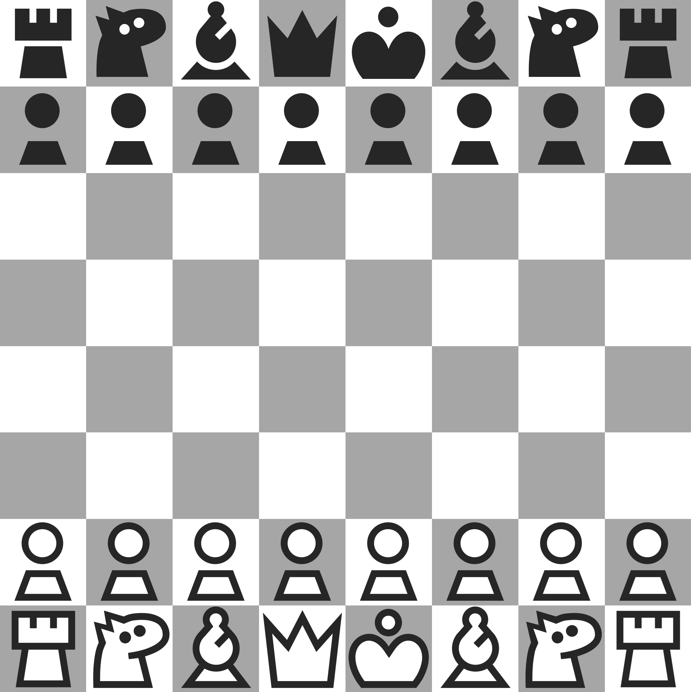
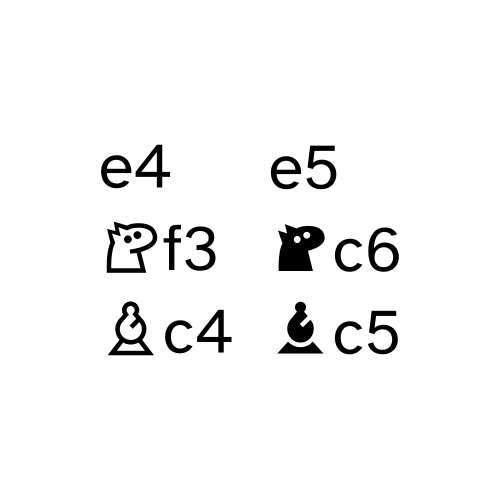

# kiwen suwi

Chess theme made to be elegant, minimalist, and adorable. Works well with light-shaded board.

## High contrast

Pieces with highest contrast possible. Works well with any board!

## Black only

Black only glyphs intended for fonts (see below). Black pieces are filled and white pieces are hollow black outline.

## Font

A very legible font, thanks to its simplicity. Optimized for figurine notation. (ASCII or Latin glyphs not included in the font)

---

[Download the assets or font](https://github.com/neverRare/kiwen-suwi/releases)

There's no official way to use this on [chess.com] nor [lichess] unfortunately. [But you can customize it with third-party browser extension](./site-customization.md).

[chess.com]: https://www.chess.com/
[lichess]: https://lichess.org/

## License

Assets, including images and vector files, are licensed under [CC BY 4.0](./LICENSE-CC%20BY%204.0). The font is licensed under [OFL](./LICENSE-OFL). The CSS files used to customize chess.com or lichess is licensed under [MIT](./LICENSE-MIT)

## TODO

- [x] High contrast theme
- [x] Black only theme
- [ ] Better alt text
- [x] Font
- [ ] ~~Fairy pieces~~
- [ ] Instruction to use in chess.com or lichess via third party browser extension
