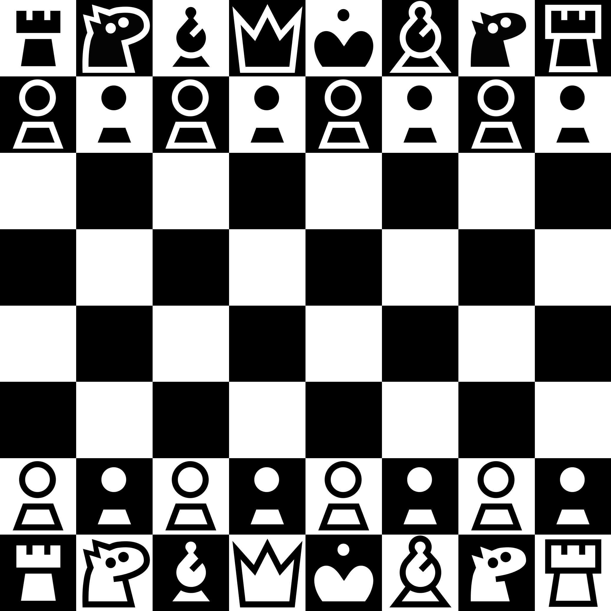

# kiwen suwi

Chess theme made to be elegant, minimalist, and adorable. Works well with light-shaded board.

## High contrast (Deprecated)

Pieces with highest contrast possible. Works well with any board!

> Note: Deprecated, will be replaced with better designed

## Font

A very legible font, thanks to its simplicity. Optimized for figurine notation. (ASCII or Latin glyphs not included in the font)

---

[Download the assets or font](https://github.com/neverRare/kiwen-suwi/releases)

A [pull request adding kiwen suwi to Lichess][pull request] has been merged. It's not yet available on Lichess itself but at anytime it may become available. So if you're using [Lichess] and want kiwen suwi, just wait!

On [Chess.com] however, kiwen suwi is very unlikely to get added. So one have to customize it with third-party browser extension: [customization instruction][customize].

I don't encourage this. I recommend waiting but if you can't wait and want to customize [Lichess] anyway with third-party browser extension, [here's the instruction][customize].

[pull request]: https://github.com/lichess-org/lila/pull/12632
[Chess.com]: https://www.chess.com/
[Lichess]: https://lichess.org/
[customize]: ./site-customization.md

## License

Assets, including images and vector files, are licensed under [CC BY 4.0](./LICENSE-CC%20BY%204.0). The font is licensed under [OFL](./LICENSE-OFL). The CSS files used to customize Chess.com or Lichess is licensed under [MIT](./LICENSE-MIT).
