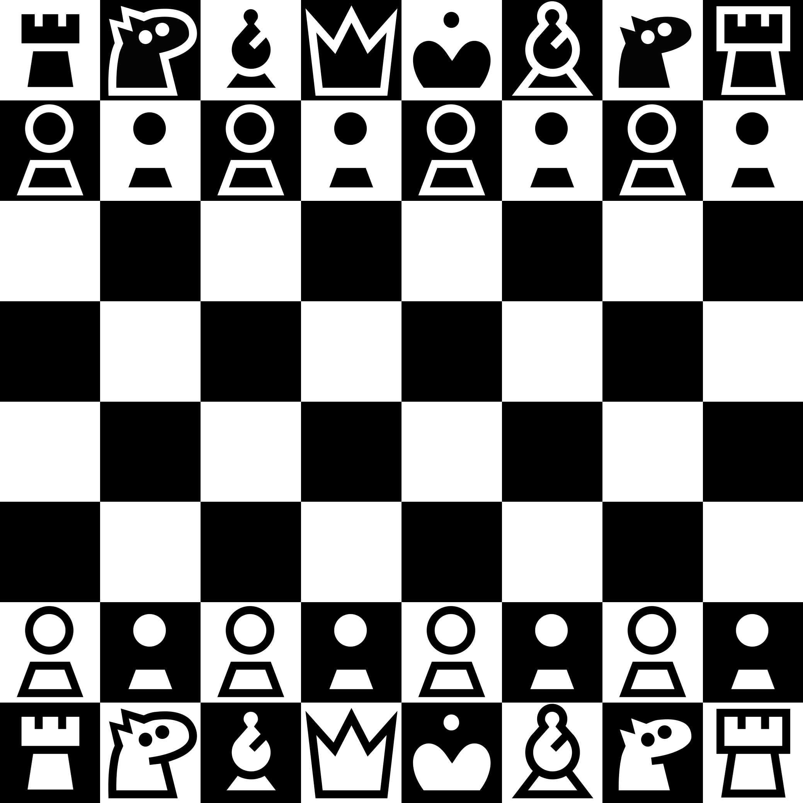

# kiwen suwi

Chess theme made to be elegant, minimalist, and adorable. Works well with light-shaded board.

## High contrast

Pieces with highest contrast possible. Works well with any board!

## Black only

Black only glyphs intended for fonts (see below). Black pieces are filled and white pieces are hollow black outline.

## Font

A very legible font, thanks to its simplicity. Intended for figurine notation.

---

[Download the assets or font](https://github.com/neverRare/kiwen-suwi/releases)

As of 8 of March, there's no official way to use this on chess.com nor lichess unfortunately. One have to customize it with third-party browser extension. I won't provide instructions and do this at your own risks. I won't be responsible if something wrong happen.

## License

Assets, including images and vector files, are licensed under [CC BY 4.0](LICENSE-CC%20BY%204.0). The font is licensed under [OFL](LICENSE-OFL).

## TODO

- [x] High contrast theme
- [x] Black only theme
- [ ] Better alt text
- [ ] Font
- [ ] Fairy pieces
